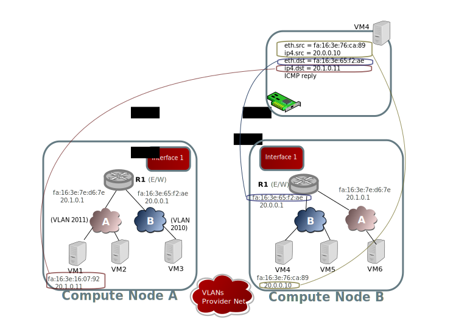
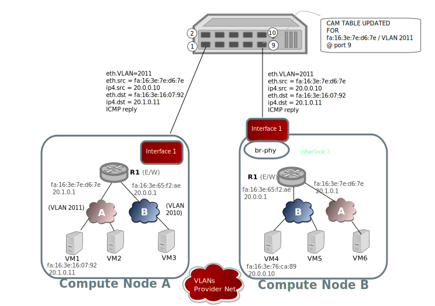
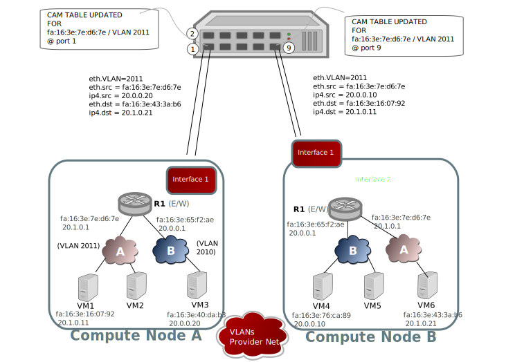

HA and Distributed are beautiful words, but complex ones. Within few seconds MAC addresses flap in the switch. 
It is for a good cause, but this anoys the admin who runs to disable 
port flapping detection in the switch, then he breaths.

I guess you picture the situation, which I have seen a few times happen. Ee already need to disable port flapping detection for
[L3HA](https://docs.openstack.org/networking-ovn/latest/admin/routing.html#l3ha-support) 
to work, so it's not a big deal.

In the next few pages I'm explaining how OVN/L3 works over VLAN
once [Anil's patches](https://patchwork.ozlabs.org/bundle/mangelajo/l3-vlan/)
are in place, and I review the life of a couple of ICMP packets
through the network.


# The network


As the diagram shows, the example network is composed of:

* _4 Chassis_:

  * Gateway Node 1
  * Gateway Node 2
  * Compute Node A
  * Compute Node B

* _3 Physical networks_:

  * **Interface 1**: VLANs provider network: The network for logical switches traffic, each logical switch will have it's own VLAN ID. 
  * **Interface 2**: The overlay network: although it's not used for carrying traffic we still rely on [BFD monitoring](https://docs.openstack.org/networking-ovn/latest/admin/routing.html#bfd-monitoring) over the overlay network for L3HA purposes (deciding on the master/backup state)
  * **Interface 3**: Internet/Provider Network: Our external network.

* _2 Logical Switches_ (or virtual networks):
  * **A** with CIDR 20.1.0.0/24 and a localnet port to vlan provider network, tag: 2011
  * **B** with CIDR 20.0.0.0/24 and a localnet port to vlan provider network, tag: 2010
  * **C** irrelevant

* _1 Logical Router_:
  * **R1** which has three logical router ports:
      * On LS A
      * On LS B
      * On external network
 


# The journey of the packet

In the next lines I'm tracking the small ICMP echo packet on its journey through the different network elements. You can see a detailed route plan in See [Packet 1 ovn-trace](#packet-1-ovn-trace)

## The inception


The packet is created inside VM1, where it has a virtual interface with the 20.1.0.11/24 address (fa:16:3e:16:07:92 MAC), and a default route to 20.1.0.1 (fa:16:3e:7e:d6:7e) for anything outside it's subnet.

## On it's way out VM1


As the packet is handled by br-int OpenFlow rules for the logical router pipeline the source MAC address is replaced with the router logical port on logical switch B, and destination MAC is replaced with the destination port MAC on VM4. Afterwards the destination network VLAN tag for logical switch B attached to the packet.

## The physical switch

The packet leaves the virtual switch br-phy, through interface 1, reaching the Top of Rack switch.


The ToR switch CAM table is updated for 2010 fa:16:3e:65:f2:ae which is R1's leg into virtual network B (logical switch B).

| vid + MAC                  |   port   | age   |
|----------------------------|----------|-------|         
| **2010 fa:16:3e:65:f2:ae** |  **1**   | **0** |
| 2011 fa:16:3e:16:07:92     |    1     |  12   |
| 2010 fa:16:3e:75:ca:89     |    9     |  10   |

## Going into VM4

As the packet arrives to the hypervisor, it's decapsulated from the VLAN tag, and directed to the VM4 tap.


## The return

VM4 receives the ICMP request and responds to it with an ICMP echo reply. The new packet is directed to R1's MAC and VM1's IP address.



## On it's way out of VM4

As the packet is handled by br-int OpenFlow rules for the logical router pipeline the source MAC address is replaced with the router logical port on logical switch B, and destination MAC is replaced with the destination port MAC on VM4.


Afterwards the destination network VLAN tag for logical switch B attached to the packet.


## The physical switch (on it's way back)

The packet leaves the virtual switch br-phy, through interface 9, reaching the Top of Rack Switch.



The ToR switch CAM table is updated for 2011 fa:16:3e:7e:d6:7e on port 9 which is R1's leg into virtual network A (logical switch A).

| vid + MAC                  |   port   | age   |
|----------------------------|----------|-------| 
| 2010 fa:16:3e:65:f2:ae     |    1     |   1   |
| 2011 fa:16:3e:16:07:92     |    1     |  12   |
| **2011 fa:16:3e:7e:d6:7e** |  **9**   | **0** |   
| 2010 fa:16:3e:75:ca:89     |    9     |  10   |


## The end

By the end of it's journey, the ICMP packet crosses br-phy, where the OpenFlow rules will decapsulate from localnet port into LS A, and direct the packet to VM1, as the eth.dst patches VM1's MAC address.


VM1 receives the packet normally, coming from VM4 (20.0.0.10) through our virtual R1 (fa:16:3e:7e:d6:7e).


## The end?, oh no

We need to explore the case where we have ongoing communications from VM6 to VM3, and VM1 to VM4. Both cases are East/West traffic communication, that will make the R1 MAC addresses flip in ToR switch CAM table.




## Annex

### <a name="packet-ovn-trace"></a>Packet 1 ovn-trace
```console
$ ovn-trace --detailed neutron-0901bce9-c812-4fab-9844-f8ac1cdee066 'inport == "port-net2" && eth.src == fa:16:3e:16:07:92 && eth.dst==fa:16:3e:7e:d6:7e && ip4.src==20.1.0.11 && ip4.dst==20.0.0.10 && ip.ttl==32'
# ip,reg14=0x4,vlan_tci=0x0000,dl_src=fa:16:3e:16:07:92,dl_dst=fa:16:3e:7e:d6:7e,nw_src=20.1.0.11,nw_dst=20.0.0.10,nw_proto=0,nw_tos=0,nw_ecn=0,nw_ttl=32

ingress(dp="net2", inport="port-net2")
--------------------------------------
 0. ls_in_port_sec_l2 (ovn-northd.c:3847): inport == "port-net2" && eth.src == {fa:16:3e:16:07:92}, priority 50, uuid 72657159
    next;
 1. ls_in_port_sec_ip (ovn-northd.c:2627): inport == "port-net2" && eth.src == fa:16:3e:16:07:92 && ip4.src == {20.1.0.11}, priority 90, uuid 2bde621e
    next;
 3. ls_in_pre_acl (ovn-northd.c:2982): ip, priority 100, uuid 6a0c272e
    reg0[0] = 1;
    next;
 5. ls_in_pre_stateful (ovn-northd.c:3109): reg0[0] == 1, priority 100, uuid 00eac4fb
    ct_next;

ct_next(ct_state=est|trk /* default (use --ct to customize) */)
---------------------------------------------------------------
 6. ls_in_acl (ovn-northd.c:3292): !ct.new && ct.est && !ct.rpl && ct_label.blocked == 0 && (inport == "port-net2" && ip4), priority 2002, uuid 25b34866
    next;
16. ls_in_l2_lkup (ovn-northd.c:4220): eth.dst == fa:16:3e:7e:d6:7e, priority 50, uuid 21005439
    outport = "575fb1";
    output;

egress(dp="net2", inport="port-net2", outport="575fb1")
-------------------------------------------------------
 1. ls_out_pre_acl (ovn-northd.c:2938): ip && outport == "575fb1", priority 110, uuid 6d74b82c
    next;
 9. ls_out_port_sec_l2 (ovn-northd.c:4303): outport == "575fb1", priority 50, uuid d022b28d
    output;
    /* output to "575fb1", type "patch" */

ingress(dp="R1", inport="lrp-575fb1")
-------------------------------------
 0. lr_in_admission (ovn-northd.c:4871): eth.dst == fa:16:3e:7e:d6:7e && inport == "lrp-575fb1", priority 50, uuid 010fb48c
    next;
 7. lr_in_ip_routing (ovn-northd.c:4413): ip4.dst == 20.0.0.0/24, priority 49, uuid 4da9c83a
    ip.ttl--;
    reg0 = ip4.dst;
    reg1 = 20.0.0.1;
    eth.src = fa:16:3e:65:f2:ae;
    outport = "lrp-db51e2";
    flags.loopback = 1;
    next;
 8. lr_in_arp_resolve (ovn-northd.c:6010): outport == "lrp-db51e2" && reg0 == 20.0.0.10, priority 100, uuid 89c23f94
    eth.dst = fa:16:3e:76:ca:89;
    next;
10. lr_in_arp_request (ovn-northd.c:6188): 1, priority 0, uuid 94e042b9
    output;

egress(dp="R1", inport="lrp-575fb1", outport="lrp-db51e2")
----------------------------------------------------------
 3. lr_out_delivery (ovn-northd.c:6216): outport == "lrp-db51e2", priority 100, uuid a127ea78
    output;
    /* output to "lrp-db51e2", type "patch" */

ingress(dp="net1", inport="db51e2")
-----------------------------------
 0. ls_in_port_sec_l2 (ovn-northd.c:3829): inport == "db51e2", priority 50, uuid 04b4900d
    next;
 3. ls_in_pre_acl (ovn-northd.c:2885): ip && inport == "db51e2", priority 110, uuid fe072d82
    next;
16. ls_in_l2_lkup (ovn-northd.c:4160): eth.dst == fa:16:3e:76:ca:89, priority 50, uuid 3a1af0d6
    outport = "a0d121";
    output;

egress(dp="net1", inport="db51e2", outport="a0d121")
----------------------------------------------------
 1. ls_out_pre_acl (ovn-northd.c:2933): ip, priority 100, uuid ffea7ed3
    reg0[0] = 1;
    next;
 2. ls_out_pre_stateful (ovn-northd.c:3054): reg0[0] == 1, priority 100, uuid 11c5e570
    ct_next;

ct_next(ct_state=est|trk /* default (use --ct to customize) */)
---------------------------------------------------------------
 4. ls_out_acl (ovn-northd.c:3289): ct.est && ct_label.blocked == 0 && (outport == "a0d121" && ip), priority 2001, uuid f9826b44
    ct_commit(ct_label=0x1/0x1);
[vagrant@hv1 devstack]$
```

# Glossary

* **E/W or East/West** : This is the kind of traffic that traverses a router from one subnet to another subnet, going through two legs of a router.
* **N/S or North/South** : This kind of traffic flow is very similar to E/W, but it's a difference that we make, at least in the world of virtual networks when we're talking of a router that has connectivity to an external network. Traffic that traverses the router into or from an external network. In the case of OVN or OpenStack, it implies the use of DNAT and or SNAT in the router, to translate internal addresses into external addresses and back.
* **L3HA** : Highly available L3 service, which eliminates any single point of failure on the routing service of the virtual network.
* **ToR switch** : Top of Rack switch, is the switch generally connected on the top of a rack to all the servers in such rack. It provides L2 connectivity.
* **CAM table** : CAM means Content Addressable Memory, it's an specific type of memory that instead of being accessed by address is accessed by "key", in the case of switches, for the MAC table, it's accessed by MAC+VLAN ID.